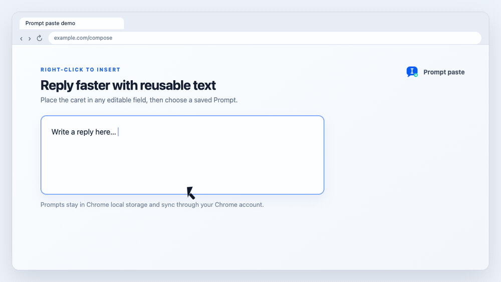
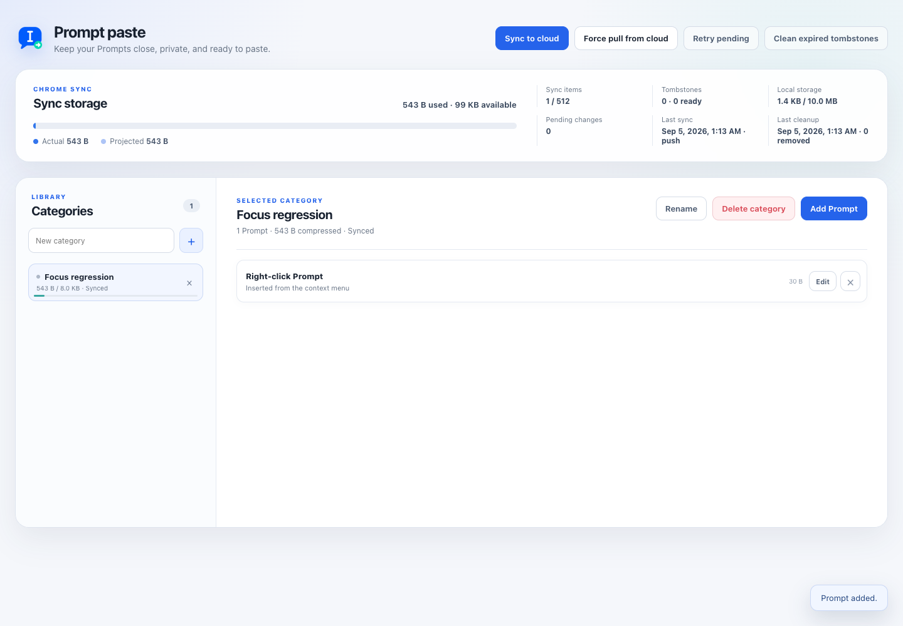

# Prompt paste

<details>
<summary><strong>🇨🇳 简体中文（点击在当前页面展开）</strong></summary>

一个小巧、本地优先的 Chrome 扩展，让你通过右键菜单快速粘贴常用文本。

你可以把常用文本按照分类保存。在网页的输入框中右键，选择“分类 → Prompt”，扩展就会在光标位置插入文本；如果已经选中一段文字，则会直接替换选中的内容。



> 动图用于展示操作流程。Chrome 原生右键菜单的外观会因操作系统和 Chrome 版本而略有不同。

## 功能

- 通过右键菜单快速插入常用文本。
- 使用分类整理 Prompt。
- 支持普通输入框、多行文本框和许多富文本编辑器。
- 在光标位置插入，或替换当前选中的文字。
- 数据优先保存在本地，并可通过 Chrome Sync 跨设备同步。
- 没有统计、追踪、广告、开发者服务器，也不需要永久访问所有网站。

## 安装

1. 下载本仓库并解压，或者使用 Git 克隆仓库。
2. 在 Google Chrome 中打开 `chrome://extensions`。
3. 开启右上角的**开发者模式**。
4. 点击**加载已解压的扩展程序**。
5. 选择包含 `manifest.json` 的项目目录。
6. 点击浏览器工具栏中的 Prompt paste 图标，打开设置页面。

项目中附带的公开公钥会让未打包扩展保持下面这个固定 ID：

```text
ggdjhafkodfdkdpjfiiaghedigdbdgpi
```

如果希望多台设备使用同一份 Chrome Sync 数据，请在所有设备上使用相同的 `manifest.json`。

## 使用方法

1. 打开 Prompt paste 设置页面。
2. 创建一个分类。
3. 在分类中添加一个或多个 Prompt。
4. 在普通网页中点击一个可编辑的输入区域。
5. 右键选择分类，然后选择要插入的 Prompt。

Prompt 会以纯文本形式插入。



## 同步与隐私

Prompt paste 会把完整的工作数据保存在 `chrome.storage.local` 中。启用 Chrome Sync 后，经过压缩的分类数据会通过 `chrome.storage.sync` 同步。

扩展不包含统计、广告或追踪代码，也没有开发者运营的服务器。Chrome 存储不是密码保险箱，请不要把密码、API Key、访问令牌或恢复码保存为 Prompt。

## 开发检查

项目不需要安装依赖，也没有构建步骤。主要检查命令如下：

```sh
node tests/verify.mjs
node tests/background-mock.mjs
```

如果在 macOS 上使用安装于 `/Applications` 的 Google Chrome，还可以运行：

```sh
node tests/chrome-cdp-smoke.mjs
```

## 开源许可证

本项目使用 MIT 许可证，详见 [LICENSE](LICENSE)。项目内置的 LZ-String 许可证保存在 `vendor/LZ-STRING-LICENSE.txt`。

</details>

<details open>
<summary><strong>🇺🇸 English</strong></summary>

A small, local-first Chrome extension for pasting reusable text from the right-click menu.

Save Prompts into categories, right-click any editable field, and choose `Category → Prompt`. Prompt paste inserts the saved text at the caret or replaces the current selection.


> The animation illustrates the interaction flow. Chrome's native context-menu appearance varies by operating system and Chrome version.

## Features

- Insert reusable text from the right-click menu.
- Organize Prompts into categories.
- Works with text inputs, textareas, and many rich-text editors.
- Inserts at the caret or replaces selected text.
- Stores the working library locally and syncs it through Chrome Sync.
- No analytics, tracking, private server, or permanent access to every website.

## Install

1. Download this repository and unzip it, or clone it with Git.
2. Open `chrome://extensions` in Google Chrome.
3. Enable **Developer mode**.
4. Click **Load unpacked**.
5. Select the project directory containing `manifest.json`.
6. Click the Prompt paste toolbar icon to open the Options page.

The bundled public key gives the unpacked extension this fixed ID:

```text
ggdjhafkodfdkdpjfiiaghedigdbdgpi
```

Keep the same `manifest.json` on every device if you want them to share the same Chrome Sync data.

## Use

1. Open the Prompt paste Options page.
2. Create a category.
3. Add one or more Prompts.
4. Focus an editable field on a normal webpage.
5. Right-click and select a category, then a Prompt.

The Prompt is inserted as plain text.


## Sync and privacy

Prompt paste keeps the complete working library in `chrome.storage.local`. Compressed category records are synchronized with `chrome.storage.sync` when Chrome Sync is available.

The extension has no analytics, advertising, tracking, or developer-operated server. Chrome storage is not a password vault, so do not save passwords, API keys, access tokens, or recovery codes as Prompts.

## Development

There is no build step or package installation. The main checks are:

```sh
node tests/verify.mjs
node tests/background-mock.mjs
```

On macOS with Google Chrome installed in `/Applications`:

```sh
node tests/chrome-cdp-smoke.mjs
```

## License

MIT. See [LICENSE](LICENSE). The vendored LZ-String license is preserved in `vendor/LZ-STRING-LICENSE.txt`.

</details>
